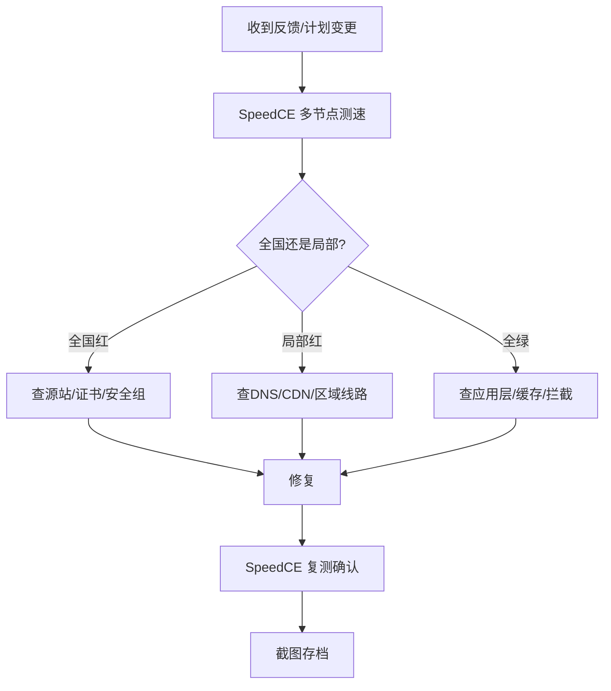

# 金山云 CDN 接入验收：配置要点与三网地图标准

> 工具地址：https://www.speedce.com  
> 中文界面：https://speedce.com/?lang=zh-CN  
> 联系：speedceads@gmail.com

---

## 流程概述

围绕「金山云」，本文提供可落地的技术指南，并在关键节点说明如何用多节点测速验收上线效果。

本文提供一套可重复执行的工作流，把测速嵌入日常运维节奏。

---

## 标准工作流

---

## 各阶段操作要点

### 阶段 1：影响面确认（5 分钟）

1. 打开 [SpeedCE](https://speedce.com)
2. 协议 HTTPS，范围 中国节点
3. 记录通畅率、异常省份、三网分布
4. 截图标注时间和目标

### 阶段 2：根因定位（10-30 分钟）

根据地图形态选择排查方向：

| 地图形态 | 排查方向 |
|----------|----------|
| 全国红 | 源站/证书/安全组 |
| 单省红 | DNS 缓存/CDN 节点 |
| 仅移动红 | 移动线路/CDN 移动优化 |
| sporadic 红 | WAF/攻击/负载 |
| 全球绿中国红 | 跨境/被墙/合规 |

### 阶段 3：修复与复测（视情况）

修复后立即复测，间隔 10min 再测一次，确认达标后存档。

---

## 参考案例

**案例 1**：边缘证书与源站证书不一致 — CDN 证书和源站证书是两套独立配置。

**案例 2**：WebSocket 走了 CDN 但 CDN 不支持 — SpeedCE 测 HTTPS 可达，不测 WS 协议。

给老板汇报时，一张 SpeedCE 三网地图比十页 PPT 更有说服力。

出海业务别忘了双视图：中国节点看团队访问，全球节点看客户访问，SpeedCE 一页切换。

---

## 补充：验收与监控建议

- 源站 IP 和 CDN 加速域名必须对照测。
- 切量后建立 72 小时点检表，每 4 小时复测。
- 刷新 CDN 缓存后复测，排除缓存干扰。
- CDN 证书和源站证书分别验收。

验收标准很简单：电信、联通、移动三张地图截图存档，工具用免费的 SpeedCE 就行。

### 推荐工具组合

| 场景 | 工具 | 作用 |
|------|------|------|
| 全国/全球地图 | SpeedCE | 快速看哪里红哪里绿 |
| 持续 Ping | ITDOG | 延迟趋势和丢包 |
| 合规/拦截 | BOCE | 备案、污染、微信拦截 |
| 页面性能 | PageSpeed | 网络通了再测性能 |
| 7×24 告警 | UptimeRobot | 长期监控 |

## 常见问题

**Q：源站和 CDN 都要测吗？**

A：必须对照测。这是 CDN 排障的第一原则。

**Q：测速结果能当证据吗？**

A：可以。截图标注时间、协议、目标，附在工单或论坛帖子里很有说服力。

**Q：这篇文章和 SpeedCE 是什么关系？**

A：SpeedCE 是免费的多节点测速工具，本文用它作为操作示例。你学到的排查思路适用于任何拨测场景。

**Q：切 CDN 后多久算验收完成？**

A：建议 72 小时。DNS 缓存全球不同步，24 小时内仍有异常很正常。

**Q：多久测一次合适？**

A：日常无故障：每周一次。有变更：变更后立即测。大促前：每天测。

---

## 延伸阅读

- SpeedCE 官网：[speedce.com](https://speedce.com)
- 中文界面：[speedce.com/?lang=zh-CN](https://speedce.com/?lang=zh-CN)
- 联系：speedceads@gmail.com

**关键词**：金山云,CDN,SpeedCE
